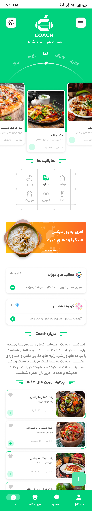
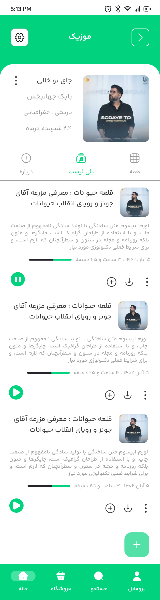
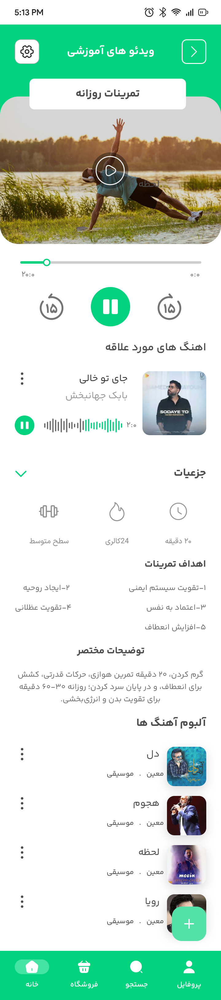
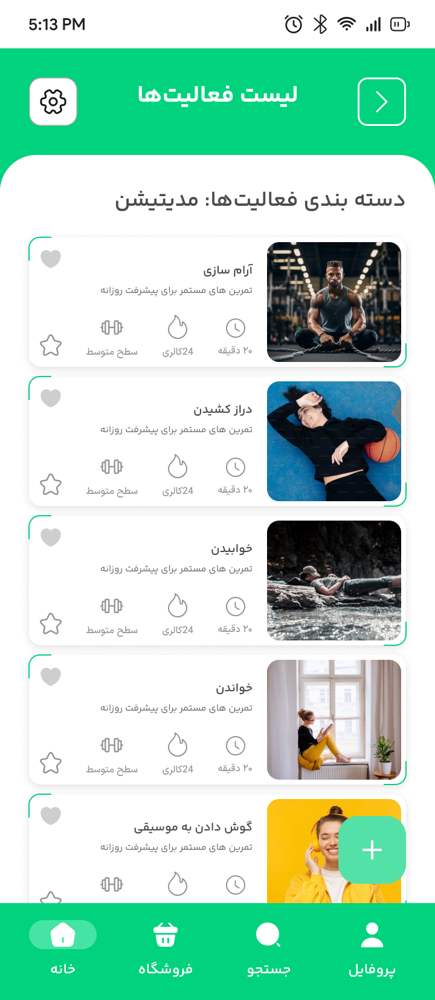

# Welcome to Coach!

  
  <image height= "100" width ="100" src="assets/logo.png"/></image>
     
  <strong>Coach</strong>  

 

## 📜 Description
Hi! Coach is a comprehensive fitness application designed to provide personalized workout and diet plans using AI-driven algorithms.the use of MVI Architecture Pattern And Clean Architecture with Jetpack Compose by following Material-3 guidelines along with other MAD libraries . The platform ensures robust security, real-time data synchronization, and seamless integration across mobile and backend systems.

## 🛠 Built With  
|  Architecture   |MVI Architecture Pattern |  
|----------------   |------------------------------    |  
|     UI Framework  | [Jetpack Compose](https://www.jetbrains.com/lp/compose-multiplatform/)         |                        |  
| 💉 DI                | [Dagger-Hilt](https://developer.android.com/training/dependency-injection/hilt-android)                        |             |  
| :floppy_disk: Local Database      | [Room Database](https://developer.android.com/topic/libraries/architecture/room)                   |  
| :compass: Navigation       | [Compose Destinations Navigation](https://developer.android.com/jetpack/compose/navigation) |  
| :thread: Asynchronous Work     | [Coroutines](https://kotlinlang.org/docs/reference/coroutines-overview.html)|  
 

## 🚀 Features
- **➕ Add, View, Update & Delete Routine and Note**
- **🔔 Notifications:** Receive notifications at the time you set for the routine
- **🌗 Dark/Light Mode:** Toggle between dark and light themes
- **🎨 Dynamic Color:** Enable or disable dynamic color settings

## :iphone: Screenshots
<table style="width:100%">
  <tr>
    <th>Splash Screen</th>
    <th>Home Screen</th>
    <th>Music Screen</th> 
    <th>Practice Screen</th> 
    <th>Activity list Screen</th> 
  </tr>
  <tr>
    <td></td> 
    <td></td>
    <td></td>
    <td></td>
    <td></td>
  </tr>
</table>
 

## 🤝 Contribution
Contributions are welcome! If you have any feedback or suggestions, please don't hesitate to let us know. We appreciate your contributions and support. Also if you find a bug or would like to create a new feature, please submit a pull request.Please read [CONTRIBUTING.md](CONTRIBUTING.md) for details on our code of conduct, and the process for submitting pull requests to us.

## License

This library is licensed under the MIT License. See [LICENSE.txt](https://github.com/RahimMahmoudzadeh/Coach/blob/master/LICENSE)
